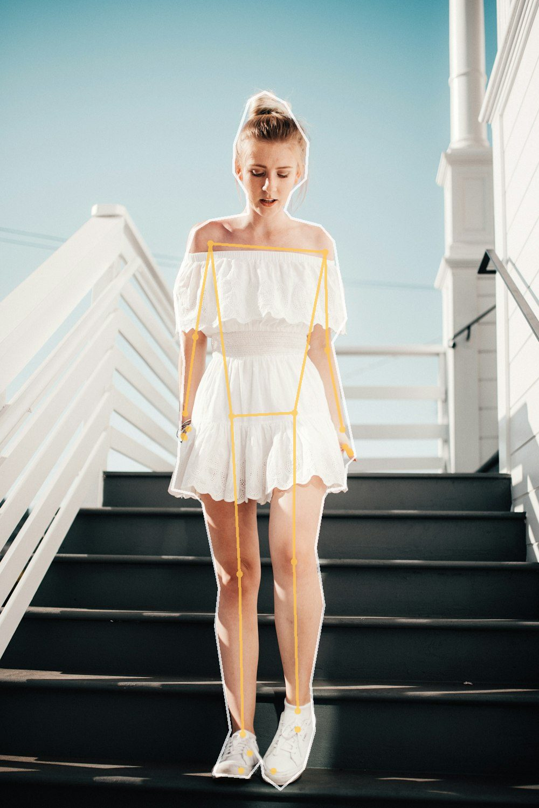
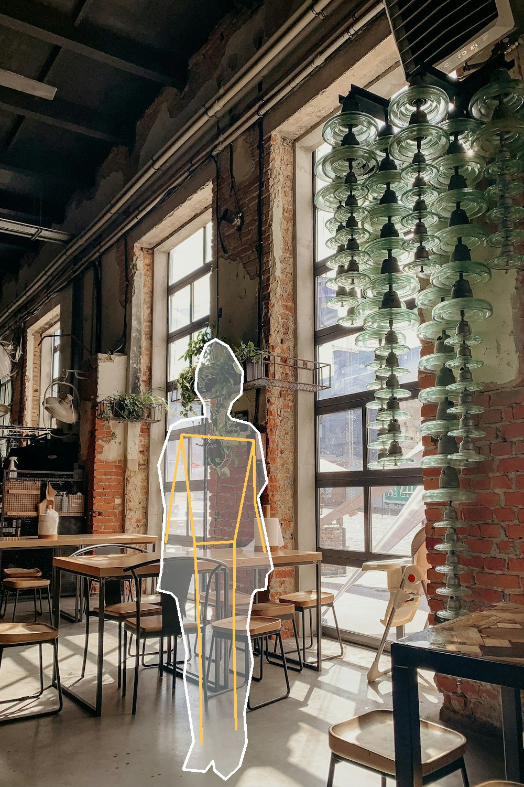
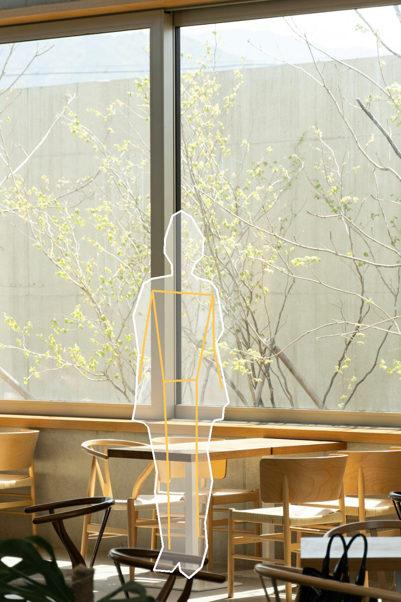
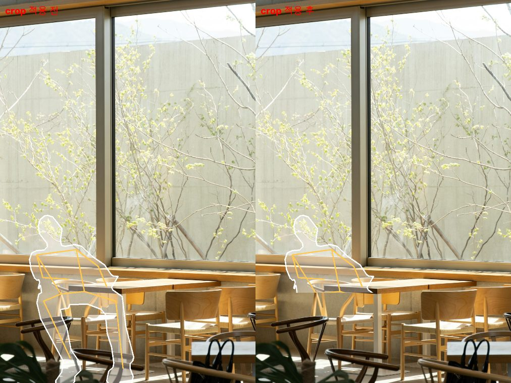
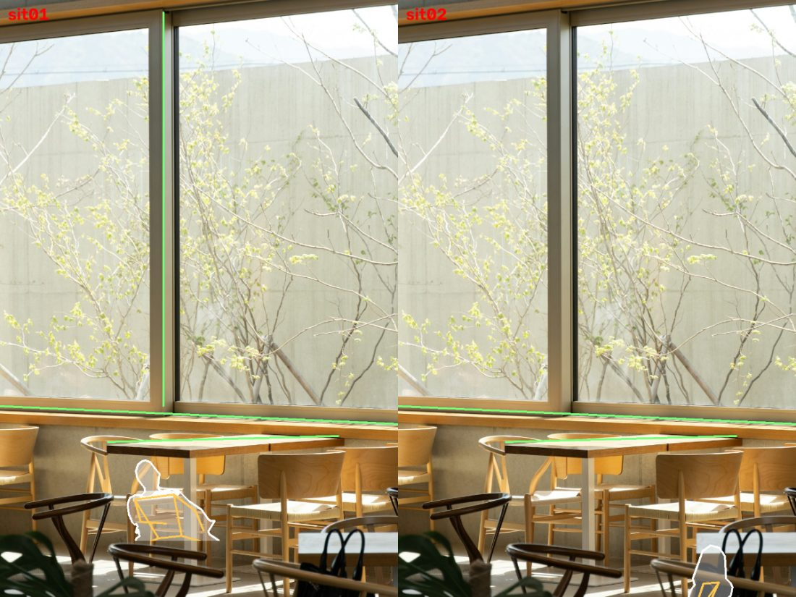
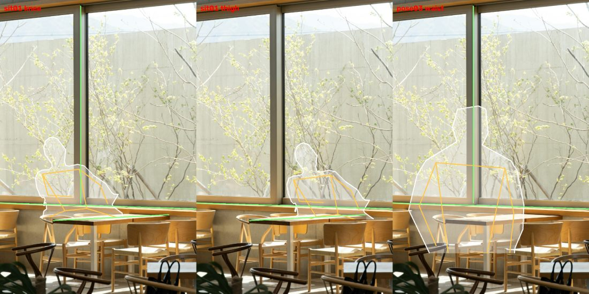
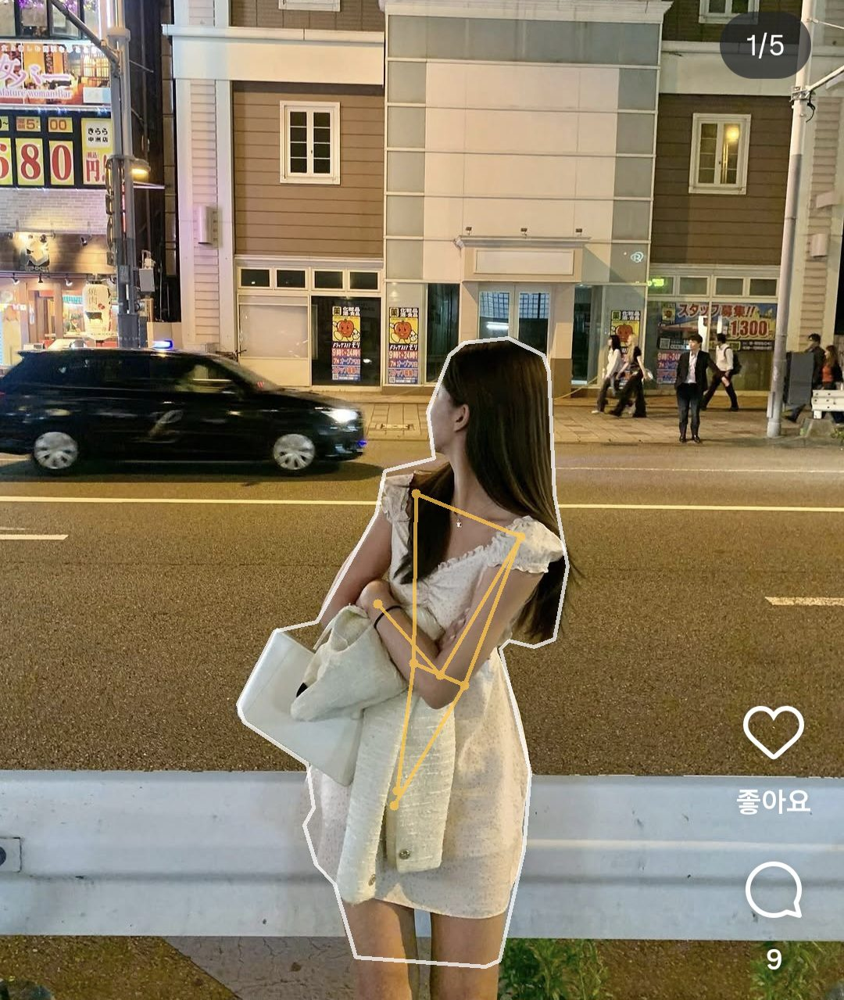

# 만들어가며 바꾼 것들

처음 설계한 대로 완성된 기능이 하나도 없습니다. 매 단계에서 눈으로 확인하고, 깨지는 걸 보고,
전제를 고쳤습니다. 그 순서를 남깁니다.

---

## 1일차 — 검증할 수단부터 만들기

기능을 만들기 전에 **결과를 눈으로 볼 장치**를 먼저 만들었습니다. 추출한 좌표를 원본 사진 위에
다시 그려보는 스크립트입니다.

흰 선이 실루엣, 노란 선이 자세 뼈대, 초록 선이 배경 구조선입니다.

이 장치 덕분에 바로 두 가지를 잡았습니다.

- **얼굴에 점이 찍혀 지저분했습니다.** 눈·코·입 위치는 구도 가이드에 쓸모가 없는데 관절로 잡혀
  있었습니다. 랜드마크 0~10을 제외해 33개에서 22개로 줄였습니다.
- **좌측 난간선이 실제 난간보다 위에 떠 있었습니다.** 손으로 찍은 좌표가 0.05 어긋나 있었는데,
  겹쳐 보지 않았으면 그냥 넘어갔을 오차입니다.

스크립트가 없었다면 템플릿을 여러 개 만든 뒤에야 발견했을 문제들입니다.

---

## 방향 전환 — 미리 만든 템플릿의 한계

원래는 잘 나온 사진에서 구도를 추출해 템플릿으로 담아둘 생각이었습니다. 그런데 템플릿을 20개
만들어도 사용자가 실제 서 있는 장소와 맞을 확률이 낮습니다. 카페 창가 템플릿을 골랐는데 눈앞의
카페는 창이 반대편이면 쓸 수 없습니다.

그래서 **배경을 찍으면 그 자리에 맞는 구도를 제안받는** 경로를 추가하기로 했습니다.
다만 되는지 확신이 없어 먼저 검증했습니다. 배경 사진에 실루엣을 합성해보는 것으로요.

창가 빛이 떨어지는 바닥에 인물을 세우고, 시각적으로 무거운 조명 설치물 반대편에 배치했습니다.
구도로 읽힙니다. **방식 자체는 성립한다**는 걸 확인했습니다.

---

## 실패 — 샷 유형을 먼저 정하지 않으면 깨진다

같은 방식을 다른 배경에 적용했더니 이렇게 됐습니다.

**다리가 테이블과 의자를 관통합니다.** 설 바닥이 없는 배경에 전신을 세운 결과입니다.

배치를 "어디에 놓을까" 하나로 봤던 게 원인이었습니다. 실제로는 세 단계였습니다.

1. **샷 유형 판정** — 빈 바닥이 있는가, 앉을 자리가 있는가, 둘 다 없으면 전경 크롭
2. 위치와 크기
3. 크롭

1번을 건너뛰어 깨진 것입니다. 첫 배경은 창가에 빈 바닥이 있어서 우연히 전신이 맞았을 뿐이었습니다.

---

## 전제를 하나 버리니 두 문제가 풀렸다

배치 모델에 **"실루엣이 프레임 안에 전부 들어가야 한다"** 는 가정이 숨어 있었습니다.
무릎 아래가 잘린 사진이 오히려 구도가 좋은 경우가 많은데도요.

박스가 0~1을 벗어날 수 있게 하고, `crop`이 라벨이 아니라 **실제로 실루엣을 잘라내게** 했습니다.

같은 자산, 같은 배치인데 왼쪽은 다리가 테이블을 뚫고 오른쪽은 테이블에 앉은 사람으로 읽힙니다.

이 하나로 두 가지가 한꺼번에 풀렸습니다.

- **설 바닥이 없는 배경도 성립합니다** — 발이 안 보이면 바닥도 필요 없습니다
- **포즈 라이브러리가 작아도 됩니다** — 전신 자세 하나로 전신·무릎위·허리위를 다 커버합니다

자르는 높이는 비율이 아니라 **관절 위치에서 계산**합니다. 자세마다 허리·무릎 높이가 달라
비율로 맞추면 어떤 자세는 허벅지를, 어떤 자세는 배를 자르게 됩니다.

---

## AI 연동 — 판단은 맞는데 렌더링이 틀렸다

실제 API를 붙이고 같은 배경을 물었습니다. 샷 유형 판정은 정확했습니다. 앉은 자세를 고르고
`crop=thigh`까지 맞췄습니다. 그런데 그려보니 이랬습니다.

**인물이 너무 작습니다.** 배경을 보여주려고 자리를 비운 게 아니라, 렌더러가 줄여버린 것입니다.

원인은 **AI가 각 자산의 가로세로비를 모른다**는 것이었습니다. 선 자세 기준으로 좁고 긴 박스를
주는데, 앉은 자세는 다리를 뻗어 가로로 넓습니다. 비율을 유지하며 좁은 박스에 맞추니 세로로도
같이 줄어든 것입니다.

프롬프트에 자산별 비율을 넣었습니다.

요청 박스의 비율이 자산과 맞아떨어지면서(0.83 vs 0.84) 크기가 제대로 잡혔습니다.

---

## 마지막 — 내 사진으로도 되게

여기까지는 미리 담아둔 자산을 쓰는 구조였습니다. 마지막으로 **사용자가 고른 사진에서 바로
본떠오는** 경로를 온디바이스로 붙였습니다.

측면이고 팔이 몸통을 가로지르고 하반신이 잘려서 관절은 8개밖에 안 잡혔습니다. 그래도
**실루엣은 들고 있는 가방과 재킷까지 제대로 따냈습니다.** 자세 모양을 전하는 데는 이걸로 충분합니다.

---

## 실기기에서만 드러난 것들

에뮬레이터에서는 멀쩡하다가 실제 폰에서 깨진 것들입니다.

| 증상 | 원인 |
| --- | --- |
| 사진 선택 시 앱이 죽음 | `Canvas: trying to draw too large(199756800bytes)` — 원본을 축소 없이 그림 |
| 실루엣 추출 실패 | 세그멘테이션 마스크는 픽셀당 float 신뢰도인데 ALPHA_8 이미지로 읽음 |
| 카메라 프리뷰가 검은 화면 | `AndroidView` 의 `update` 가 리컴포지션마다 돌아 unbind/rebind 반복 |
| 실루엣이 세로로 길쭉함 | 자산이 원본 사진의 종횡비를 들고 있지 않음 |
| 16KB 페이지 정렬 경고 | MediaPipe 0.10.21 의 네이티브 라이브러리 |

마지막 것은 경고 문구만 믿지 않고 APK 의 ELF 헤더를 직접 읽어 `align=16384` 를 확인했습니다.

---

## 돌아보면

가장 값어치 있었던 결정은 **1일차에 검증 스크립트부터 만든 것**입니다.

이 문서의 실패들은 전부 "그려봤더니 이상했다"로 발견됐습니다. 숫자만 봤다면 좌표가 그럴듯해
보여서 넘어갔을 것들입니다. 특히 AI 제안은 JSON 만 보면 완벽했습니다 — 샷 유형도 맞고
크롭도 맞았으니까요. 렌더링해보고서야 인물이 작다는 걸 알았습니다.

AI 를 쓰는 작업일수록 **출력이 그럴듯해 보이는 것과 실제로 맞는 것을 구분할 장치**가
먼저 필요하다는 걸 배웠습니다.
